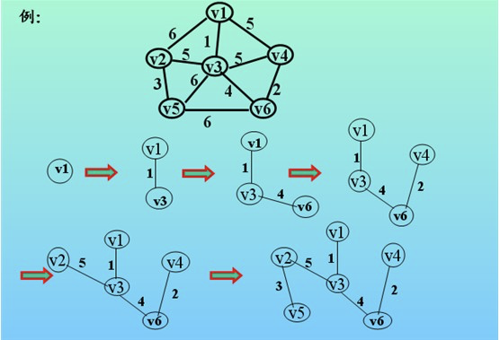

# Minimum Spanning Tree

## Prim

1. Initialize U={v} and take all edges from v to other vertices as candidate edges (all edges in U to other vertices).
2. Repeat the following step (n-1) so that the other (n-1) vertices are added to U.
    1. Select the edge with the smallest weight, let the vertex of the edge in V-U (subtraction) be k, and add k to U.
    2. Examine all vertex j in the current V-U and modify the candidate edge. If the weight of the edge (k,j) is less than the candidate edge associated with vertex j, replace the latter with (k,j) as the candidate edge.

## **Kruskal**

1. Sort all the edges in non-decreasing order of their weight.
2. Pick the smallest edge. Check if it forms a cycle with the spanning tree formed so far. If cycle is not formed, include this edge. Else, discard it.
3. Repeat step#2 until there are (V-1) edges in the spanning tree.

| Weight | Src | Dest |
| --- | --- | --- |
| 1 | 7 | 6 |
| 2 | 8 | 2 |
| 2 | 6 | 5 |
| 4 | 0 | 1 |
| 4 | 2 | 5 |
| 6 | 8 | 6 |
| 7 | 2 | 3 |
| 7 | 7 | 8 |
| 8 | 0 | 7 |
| 8 | 1 | 2 |
| 9 | 3 | 4 |
| 10 | 5 | 4 |
| 11 | 1 | 7 |
| 14 | 3 | 5 |

