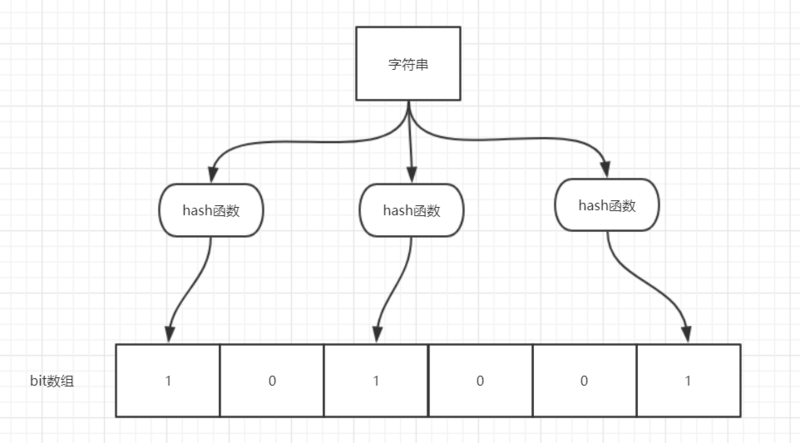

# Bloom Filter

## Add an Element

- Use the hash function in the Bloom filter to calculate the element value and get the hash value (several hash functions get several hash values).
- According to the hash value obtained, the value of the corresponding array position is set 1.

## Determine an Element

- Perform the same hash calculation on the given element again
- After getting the value, determine whether each element in the array is 1. If the value is 1, then this value is in the Bloom filter. If there is a value that is not 1, the element is not in the Bloom filter.

<aside>
💡 If the Bloom filter says that an element exists, it is unlikely that it will be misjudged. If the Bloom filter says that an element is not there, then this element must not be there.

</aside>