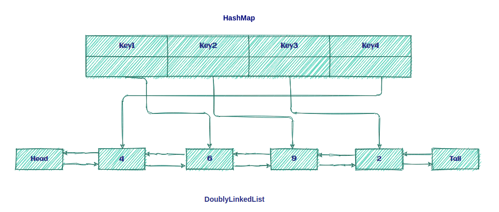

# LRU Cache

<aside>
💡 All operations should run in order of O(1).

</aside>

## Data Structure

- `Queue` – Use a **doubly-linked list**. The maximum **size** of the queue is determined by the cache size(the total number of available frames). The **least recently** used pages will be near the **rear** of the queue whereas the **most recently** used pages will be towards the **head** of the queue.
- `HashMap` – Store the **page number** as the **key** along with the **address** of the corresponding queue node as the **value**.

## Algorithm

- After a **cache miss**:
    1. If cache is full, **delete** the **tail** of the list and **the reference** in HashMap.
    2. Add a **new element** in **front** of the list.
    3. Add a **new entry** in HashMap and refer to the **head** of the list.
- After a **cache hit**:
    1. **Remove the hit** element and **add** it in **front** of the list.
    2. **Update** HashMap with a **new reference** to the **head** of the list.

> [Leetcode - LRU Cache](https://leetcode.cn/problems/lru-cache/)
>