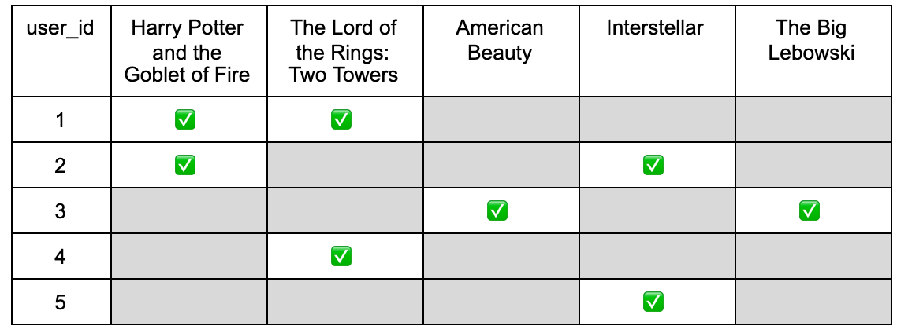

# Relational VS Non-relational DB

## Relational Database

- Store data into **table**
    
    Row represents entity and Column represents attributes.
    
- Each table has a **primary key**
    
    Data in the table is linked to other tables via **relations** consisting of primary key - foreign key pairs.
    
- Use **SQL**(Structured Query Language) to query.

---

**Example**: 

- Table: Weather
- Columns: Days of the week
- Rows: Time of Day
- Data: Degrees

## Non-relational Database

- Built for **unstructured** data:
    1. Key-value stores
    2. Document 
    3. Graph
    4. Wide-column stores
    
    > Store information into rows and columns, but rows have different values in different columns
    > 
    
    
    

---

**Example**: FaceBook Messenger

## Comparison

1. Non-relational databases offer **high availability** - always available for read and write even when faced with network failure.
    
    Relational databases focus on **high consistency**.
    
2. Relational databases are usually developed over a single server or node. Scaling is **slower** and more **expensive**.
    
    Non-relational databases are distributed by design. Scaling is **faster** and **cheaper**.
    
3. Relational databases are best for **structured data** by **table** model.
    
    Non-relational databases are best for **different data structure**.
    
4. Non-relational databases are designed to handle **big amounts of data** which may break a relational database.