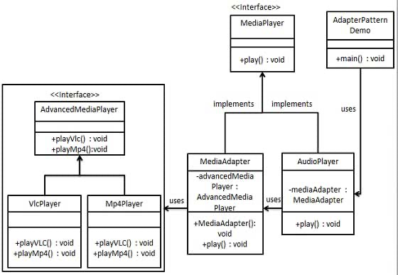

# Adapter Pattern

<aside>
💡 Work as a bridge between two incompatible interfaces.

</aside>



### Create Adapter Class

```java
public class MediaAdapter implements MediaPlayer {

   AdvancedMediaPlayer advancedMusicPlayer;

   public MediaAdapter(String audioType){

      if(audioType.equalsIgnoreCase("vlc") ){
         advancedMusicPlayer = new VlcPlayer();

      }else if (audioType.equalsIgnoreCase("mp4")){
         advancedMusicPlayer = new Mp4Player();
      }
   }

   @Override
   public void play(String audioType, String fileName) {

      if(audioType.equalsIgnoreCase("vlc")){
         advancedMusicPlayer.playVlc(fileName);
      }
      else if(audioType.equalsIgnoreCase("mp4")){
         advancedMusicPlayer.playMp4(fileName);
      }
   }
}
```

### Use the Adapter

```java
public class AudioPlayer implements MediaPlayer {
   MediaAdapter mediaAdapter;

   @Override
   public void play(String audioType, String fileName) {

      //inbuilt support to play mp3 music files
      if(audioType.equalsIgnoreCase("mp3")){
         System.out.println("Playing mp3 file. Name: " + fileName);
      }

      //mediaAdapter is providing support to play other file formats
      else if(audioType.equalsIgnoreCase("vlc") || audioType.equalsIgnoreCase("mp4")){
         mediaAdapter = new MediaAdapter(audioType);
         mediaAdapter.play(audioType, fileName);
      }

      else{
         System.out.println("Invalid media. " + audioType + " format not supported");
      }
   }
}
```