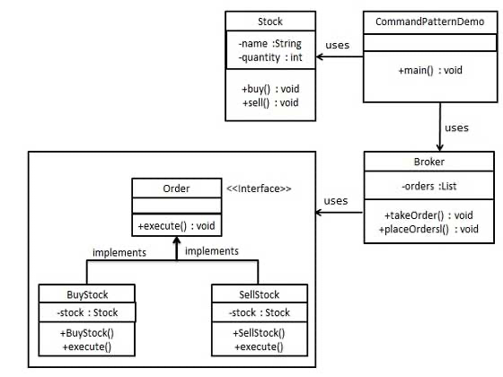

# Command Pattern

<aside>
💡 A request object includes various behaviors. Command objects composite these behaviors and are passed to an Invoker object which executes the command appropriately.

</aside>



### Create Request Class

```java
public class Stock {

   private String name = "ABC";
   private int quantity = 10;

	 // Behaviors you can composite in Command objects
   public void buy(){
      System.out.println("Stock [ Name: "+name+",
         Quantity: " + quantity +" ] bought");
   }
   public void sell(){
      System.out.println("Stock [ Name: "+name+",
         Quantity: " + quantity +" ] sold");
   }
}
```

### Create Command Class

```java
public class BuyStock implements Order {
   private Stock abcStock;

   public BuyStock(Stock abcStock){
      this.abcStock = abcStock;
   }

   public void execute() {
      abcStock.buy();
   }
}
```

```java
public class SellStock implements Order {
   private Stock abcStock;

   public SellStock(Stock abcStock){
      this.abcStock = abcStock;
   }

   public void execute() {
      abcStock.sell();
   }
}
```

### Create Command Invoker Class

```java
import java.util.ArrayList;
import java.util.List;

   public class Broker {
   private List<Order> orderList = new ArrayList<Order>();

   public void takeOrder(Order order){
      orderList.add(order);
   }

	 // Execute commands properly
   public void placeOrders(){

      for (Order order : orderList) {
         order.execute();
      }
      orderList.clear();
   }
}
```

### Use and Execute Command

```java
public class CommandPatternDemo {
   public static void main(String[] args) {
      Stock abcStock = new Stock();

			// Commands
      BuyStock buyStockOrder = new BuyStock(abcStock);
      SellStock sellStockOrder = new SellStock(abcStock);

			// Passed to command invoker class
      Broker broker = new Broker();
      broker.takeOrder(buyStockOrder);
      broker.takeOrder(sellStockOrder);

			// Execute commands
      broker.placeOrders();
   }
}
```
