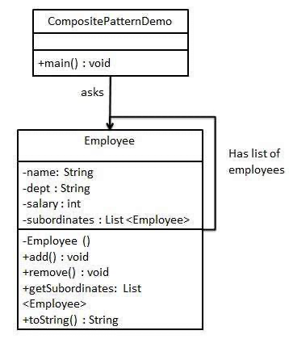

# Composite Pattern

<aside>
💡 Treat a group of objects in a similar way.

</aside>



### Create Composed Class

```java
import java.util.ArrayList;
import java.util.List;

public class Employee {
   private String name;
   private String dept;
   private int salary;
   private List<Employee> subordinates;

   // constructor
   public Employee(String name,String dept, int sal) {
      this.name = name;
      this.dept = dept;
      this.salary = sal;
      subordinates = new ArrayList<Employee>();
   }

   public void add(Employee e) {
      subordinates.add(e);
   }

   public void remove(Employee e) {
      subordinates.remove(e);
   }

   public List<Employee> getSubordinates(){
     return subordinates;
   }

   public String toString(){
      return ("Employee :[ Name : " + name + ", dept : " + dept + ", salary :" + salary+" ]");
   }
}
```

### Use Composed Class

```java
public class CompositePatternDemo {
   public static void main(String[] args) {

      Employee CEO = new Employee("John","CEO", 30000);

      Employee headSales = new Employee("Robert","Head Sales", 20000);

      Employee headMarketing = new Employee("Michel","Head Marketing", 20000);

      Employee clerk1 = new Employee("Laura","Marketing", 10000);
      Employee clerk2 = new Employee("Bob","Marketing", 10000);

      Employee salesExecutive1 = new Employee("Richard","Sales", 10000);
      Employee salesExecutive2 = new Employee("Rob","Sales", 10000);

      CEO.add(headSales);
      CEO.add(headMarketing);

      headSales.add(salesExecutive1);
      headSales.add(salesExecutive2);

      headMarketing.add(clerk1);
      headMarketing.add(clerk2);

      //print all employees of the organization
      System.out.println(CEO);

      for (Employee headEmployee : CEO.getSubordinates()) {
         System.out.println(headEmployee);

         for (Employee employee : headEmployee.getSubordinates()) {
            System.out.println(employee);
         }
      }
   }
}
```