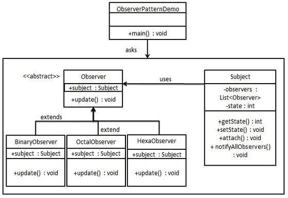

# Observer Pattern

<aside>
💡 One-to-many relationship between objects such as if one object is modified, its dependent objects are to be notified automatically.

</aside>



### Create Subject(will update) Class

```java
import java.util.ArrayList;
import java.util.List;

public class Subject {

   private List<Observer> observers = new ArrayList<Observer>();
   private int state;

   public int getState() {
      return state;
   }

	 // when state changed, notify observers
   public void setState(int state) {
      this.state = state;
      notifyAllObservers();
   }

	 // attach itself to certian observers
   public void attach(Observer observer){
      observers.add(observer);
   }

   public void notifyAllObservers(){
      for (Observer observer : observers) {
         observer.update();
      }
   }
}
```

### Create Observer Class like this

```java
public class BinaryObserver extends Observer{

   public BinaryObserver(Subject subject){
      this.subject = subject;
			// add this observer to subject's observer lists
      this.subject.attach(this);
   }

   @Override
   public void update() {
      System.out.println( "Binary String: " + Integer.toBinaryString( subject.getState() ) );
   }
}
```

### Create Subject and Attach to Observers

```java
public class ObserverPatternDemo {
   public static void main(String[] args) {
      Subject subject = new Subject();

			// attach observers
      new HexaObserver(subject);
      new OctalObserver(subject);
      new BinaryObserver(subject);

      System.out.println("First state change: 15");
      subject.setState(15);
      System.out.println("Second state change: 10");
      subject.setState(10);
   }
}
```