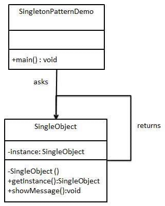

# Singleton Pattern

<aside>
💡 A single class makes sure only single object gets created and provides a way to access it without instantiating the object of the class.

</aside>



## lazy(not thread safe)

```java
public class Singleton {
   private static Singleton instance;
   private Singleton(){}
   public static Singleton getInstance(){
			if (instance == null) {  
            instance = new Singleton();
			}
      return instance;
   }
}
```

## lazy(thread safe)

```java
public class Singleton {  
    private static Singleton instance;  
    private Singleton (){}  
    public static synchronized Singleton getInstance() {  
        if (instance == null) {  
            instance = new Singleton();  
        }  
        return instance;  
    }  
}
```

## hungry

```java
public class Singleton {  
    private static Singleton instance = new Singleton();  
    private Singleton (){}  
    public static Singleton getInstance() {  
		    return instance;  
    }  
}
```

## double check

```java
public class Singleton {  
    private volatile static Singleton singleton;  
    private Singleton (){}  
    public static Singleton getSingleton() {  
				
		    if (singleton == null) {  
						
		        synchronized (Singleton.class) { 
								
		            if (singleton == null) {  
		                singleton = new Singleton();  
		            }  
		        }  
		    }  
		    return singleton;  
    }  
}
```