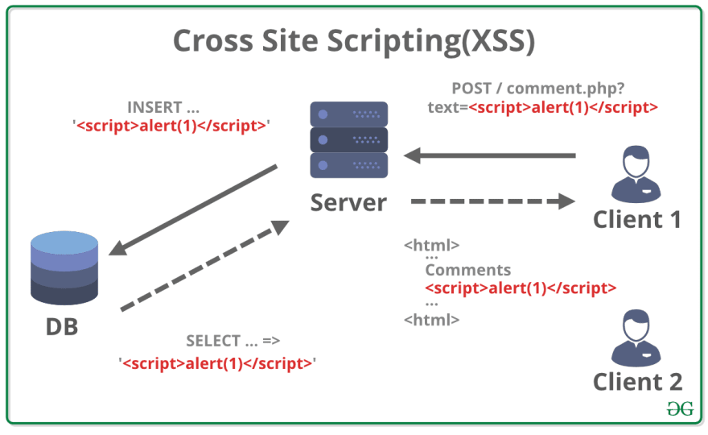
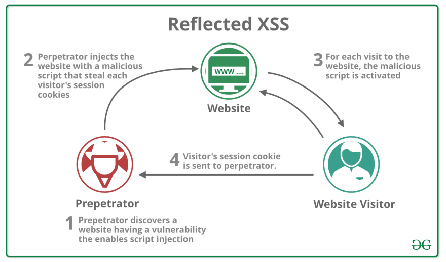

# Attack

# XSS

## Stored XSS

> Vulnerability coming from unprotected and not sanitized
 **user inputs** those are directly stored in database and displayed to other users.
> 



## Reflected XSS

> Reflected XSS - Vulnerability coming from unprotected and not sanitized values from **URLs** those are directly used in web pages.
> 



## Protection

### 1. String validation

Validation is the method where user defines set of rules, and demand *untrusted data* to satisfy those rules before moving on. 

### 2. String escape

Escape method is useful for cases where you should enable user to use punctuation marks. This method goes through string and looks for special characters, such as `<` `>` and replace them with appropriate HTML character entity name. 

```jsx
function escapeText(text) {
  return text.replace(/&/g, '&amp;')
             .replace(/</g, '&lt;')
             .replace(/>/g, '&gt;')
             .replace(/"/g, '&quot;')
}
```

# CSRF

> User's web browser **perform an unwanted action on an other trusted site** where the user is authenticated.
> 
- Assume you are currently logged into your online banking at `www.mybank.com`
- Assume a money transfer from `mybank.com` will result in a request of (conceptually) the form `http://www.mybank.com/transfer?to=<SomeAccountnumber>;amount=<SomeAmount>`. (Your account number is not needed, because it is implied by your login.)
- You visit `www.cute-cat-pictures.org`, not knowing that it is a malicious site.
- If the owner of that site knows the form of the above request and correctly guesses you are logged into `mybank.com`, they could include on their page a request like `http://www.mybank.com/transfer?to=123456;amount=10000` (where `123456` is the number of their Cayman Islands account and `10000` is an amount that you previously thought you were *glad* to possess).
- *You* retrieved that `www.cute-cat-pictures.org` page, so *your* browser will make that request.
- Your bank cannot recognize this origin of the request: Your web browser will send the request along with your `www.mybank.com` cookie and it will look perfectly legitimate. There goes your money!

## CSRF token

- The transfer request is extended with a third argument: `http://www.mybank.com/transfer?to=123456;amount=10000;token=31415926535897932384626433832795028841971`.
- That token is a huge, impossible-to-guess random number that `mybank.com` will include on their own web page when they serve it to you. It is *different* each time they serve any page to anybody.
- The attacker is not able to guess the token, is not able to convince your web browser to surrender it, and so the attacker will *not* be able to create a valid request, because requests with the wrong token (or no token) will be refused by `www.mybank.com`.