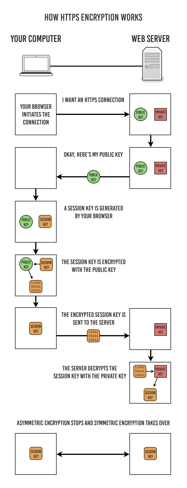

# HTTPS

## Certification Chain

- `CA_ZHIHU`-> `CA_GEO`-> `CA_ROOT`
- A -> B means **A** is **signed by the private key** corresponding to the public key contained in **B**.
- The root certificate is self-signed.

### Construction of Root Certification

1. The root authentication agency CA generates the public key `ca_KeyPub` and the private key `ca_KeyPri`, as well as the basic information `ca_Info`(name of CA, the validity period of the certificate…) .
2. CA performs hash operations on `ca_KeyPub + ca_Info` to get the hash value `ca_Hash`.
3. CA uses its private key `ca_KeyPri` to encrypt `ca_Hash` asymmetrically to obtain the encrypted hash value `enc_ca_Hash`.
4. CA generates a self-signed digital certificate `ca_Cert` by combining `ca_KeyPub + ca_Info + enc_ca_Hash`. This certificate is called the root certificate.

> `ca_Cert` can sign the next level certificate.
> 

### Construction of a Secondary (or above) Certification

1. The secondary certification authority CA2 generates the public key `ca2_KeyPub` and the private key `ca2_KeyPri`, as well as the basic information `ca2_Info`(name of CA2, the validity period of the certificate…).
2. CA2 sends `ca2_KeyPub` and `ca2_Info` to CA.
3. After verifying CA2's identity in some way, CA perform hash operations on `ca2_KeyPub + ca2_Info + ca_Info` to get Hash value `ca2_Hash`.
4. CA uses its private key `ca_KeyPri` to encrypt `ca2_Hash` asymmetrically to obtain the encrypted hash value `enc_ca2_Hash`.
5. CA returns the `ca2_KeyPub + ca2_Info + ca_Info + enc_ca2_Hash` as `ca2_Cert` to CA2.

> `ca2_Cert` can sign the next level certificate.
> 

### Certificate Signature of a Secondary (or above) Certification

1. Server S2 generates the public key `s2_KeyPub` and the private key `s2_KeyPri`, as well as the basic information `s2_Info`(name of S2, the validity period of the certificate…).
2. S2 sends `s2_KeyPub` and `s2_Info` to CA2.
3. After verifying the identity of S2 in some way, CA2 perform hash operations on `s2_KeyPub + s2_Info + ca2_Info`to get Hash value `s2_Hash`.
4. CA2 uses its private key `ca2_KeyPri` to encrypt `s2_Hash` asymmetrically to obtain the encrypted hash value `enc_s2_Hash`.
5. CA2 returns the `s2_KeyPub + s2_Info + ca2_Info + enc_s2_Hash` as `s2_Cert` to S2.

> `s2_Cert` cannot sign the next level certificate.
> 

### Verification of a Secondary (or above) Certification

1. Server S2 sends certificates `s2_Cert` and `ca2_Cert`to client C.
2. C checked `ca2_Info` in `s2_Cert` and found it was signed by CA2.
3. C takes out the `ca2_KeyPub` in `ca2_Cert`and decrypts `enc_s2_Hash` in `s2_Cert` to get `s2_Hash`.
4. C performs hash operations on `s2_KeyPub + s2_Info + ca2_Info` in `s2_Cert` to get the hash value `s2_Hash_tmp`.
5. C determines whether `s2_Hash` and `s2_Hash_tmp` are equal. If the two are equal, prove that the `s2_Cert` was signed by `ca2_Cert`.
6. C checked `ca_Info` in `ca2_Cert` and found that it was signed by CA.
7. C takes out the `ca_KeyPub` in `ca_Cert` and decrypts `enc_ca2_Hash` in `ca2_Cert` to get `ca2_Hash`.
8. C performs hash operations on `ca2_KeyPub + ca2_Info + ca_Info` in `ca2_Cert` to get the hash value `ca2_Hash_tmp`.
9. C determines whether `ca2_Hash` and `ca2_Hash_tmp` are equal. If the two are equal, prove that `ca2_Cert` is signed by `ca_Cert`.
10. C checked `ca_Cert` and found that the certificate was the root certificate and had been trusted by the system.

## Revocation of Certificates

1. **Online Check**: The client **sends a request** to the CA institution to check the reliability of the public key.
2. Store **Certificate Revocation List** (CRL): Update regularly.

## SSL Protocol

### HTTP

> Data transferred in **plain text**.
> 
1. **Eavesdropping**
2. **Tampering**
3. **Pretending**

### HTTPS(HTTP + SSL)

1. All information is transmitted **encrypted** and cannot be eavesdropped by third parties.
2. There is a **verification** mechanism. Once data is tampered, both sides of the communication will find it immediately.
3. Equipped with a **certificate** to prevent identity from being impersonated.

## How SSL works

1. Client starts Https request, providing:
    - Support **protocol version** (e.g. TLS 1.0)
    - A random number `r1`
    - Support **encryption** method
    - Support **compression** method
2. Server returns:
    - Confirm protocol version
    - A random number `r2`
    - Confirm encryption method
    - Server **certificate**
3. Client **validates** the certificate successfully and returns:
    - A random number `r3` encrypted by **server’s public key**
    - Notify subsequent information will be sent with mutually agreed **encryption** methods and **keys**.
    - Client **FIN**
4. Server returns:
    - Notify subsequent information will be sent with mutually agreed **encryption** methods and **keys**.
    - Server **FIN**

## **Symmetric/Asymmetric**

- **Symmetric encryption**: one key to lock and unlock, which is **fast**.
- **Asymmetric encryption**: one key lock and the other unlock, which is **slow**.

## Digital Signature

<aside>
💡 The signer encrypts the message with a private key (which is a reverse use, because the private key is usually used for decryption in asymmetric encryption), and then publishes the public key. The verifier uses the public key to decrypt the message.

</aside>