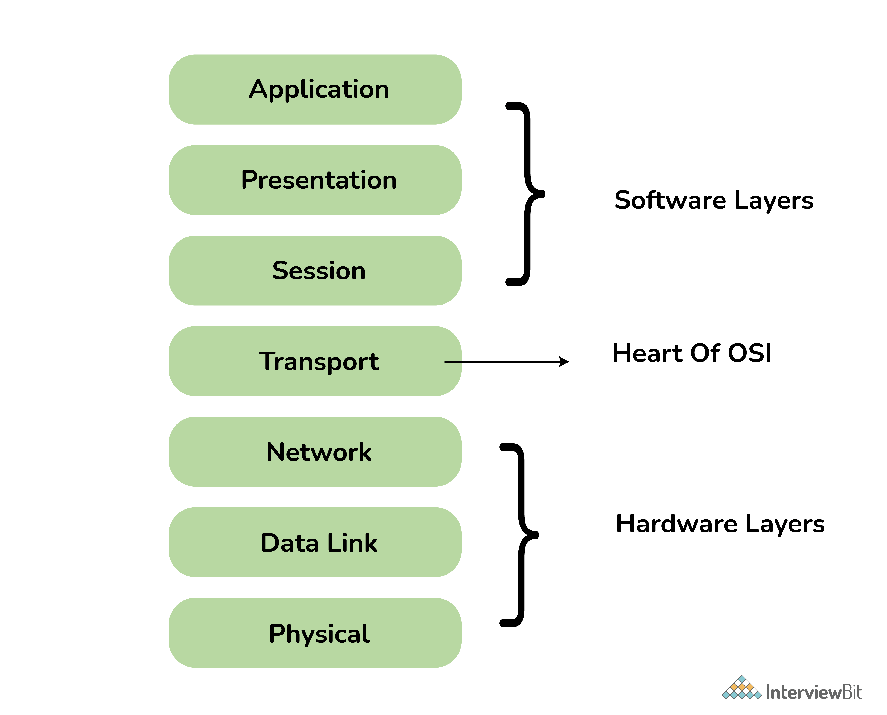
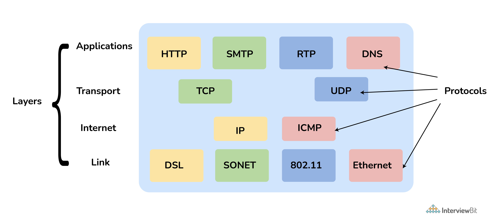

# Network Model

## OSI Model

| Layer | Unit Exchanged | Description |
| --- | --- | --- |
| Physical | Bit | It is concerned with transmitting raw bits over a communication channel. Chooses which type of transmission mode is to be selected for the transmission. The available transmission modes are Simplex, Half Duplex and Full Duplex. |
| Data Link | Frame | Detecting damaged packets using the CRC (Cyclic Redundancy Check). When more than one node is connected to a shared link, Data Link Layer protocols are required to determine which device has control over the link at a given time. It is implemented by protocols like CSMA/CD, CSMA/CA, ALOHA, and Token Passing. |
| Network | Packet | Takes care of feedback messaging through ICMP messages. |
| Transport | TPDU - Transaction Protocol Data Unit | Accept data from the above layers, split it up into smaller units if needed, pass these to the network layer, and ensure that all the pieces arrive correctly at the other end.  |
| Session | SPDU - Session Protocol Data Unit | Allows users on different machines to establish sessions between them.  |
| Presentation | PPDU - Presentation Protocol Data Unit | The syntax and semantics of the information transmitted. It translates a message from a common form to the encoded format which will be understood by the receiver. |
| Application | APDU - Application Protocol Data Unit | It contains a variety of protocols that are commonly needed by users. The application layer sends data of any size to the transport layer. |

### CRC

- Before sending, **attach a number** to the frame to be sent. The new frame should be **divisible** by the divisor selected by both the sender and receiver.
- After receiving, the receiver **divide** the new frame by the selected divisor and there should be **no remainder**. If there is a remainder, it indicates that the frame is wrong during transmission.
- **Example**:
    
    CRC generates polynomial: G(x)=x^4 + x^3 + 1 and find out the CRC of 10110011.
    
    1. Change G(x)=x^4 + x^3 + 1 ⇒ Checksum 11001
    2. Add `checksum.length-1` 0s 
    3. Add 0100 ⇒ new frame 101100110100
    4. The receiver divide the frame by 11001

## TCP/IP Model

| Layer | Description |
| --- | --- |
| Link | Decides which links such as serial lines(串行) or classic Ethernet(以太网) must be used to meet the needs of the connectionless internet layer. |
| Internet | The internet layer is the most important layer which holds the whole architecture together. It delivers the IP packets where they are supposed to be delivered. |
| Transport | Its functionality is almost the same as the OSI transport layer. It enables peer entities on the network to carry on a conversation. |
| Application | It contains all the higher-level protocols. |

## TCP/IP vs OSI

1. OSI provides a clear distinction among **services**, **protocols** and **interfaces**, but TCP/IP dose not.
2. **Minimum header size** in OSI is 5 bytes, but in TCP/IP is 20 bytes.
3. OSI is only connection-oriented, but TCP/IP is both **connection-oriented** and **connectionless**.

<aside>
💡 Connection-oriented need to establish a connection before transmission of data.  Connectionless does not need to establish the connection in advance,  but send message with a destination address and the system will choose the way for transmission.

</aside>

