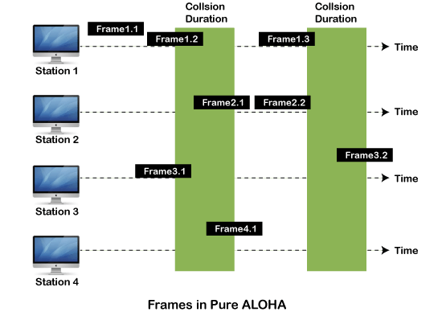
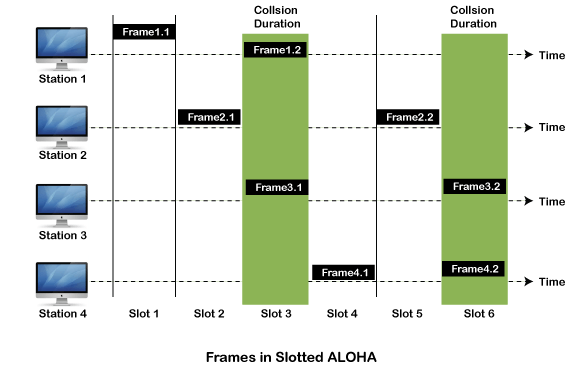
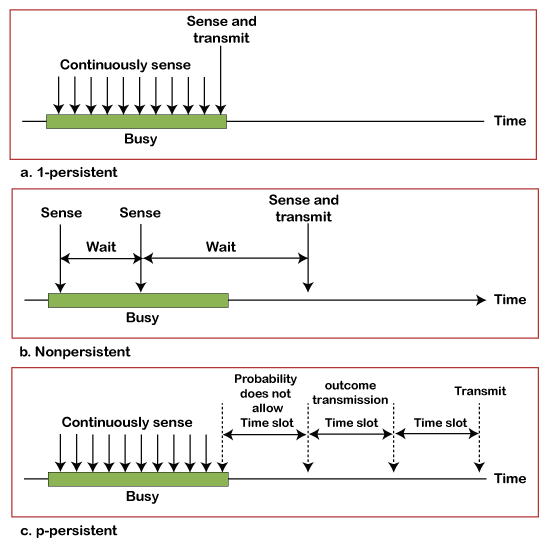

# Random Access Protocol

## Aloha

1. Any station can **transmit** data to a channel at **any time**.
2. It does **not** require any **carrier sensing**.
3. Collision and data frames may be **lost** during the transmission of data through multiple stations.
4. **Acknowledgment** of the frames exists in Aloha. Hence, there is **no collision detection**.
5. It requires **retransmission** of data after some **random amount of time**.

### Pure Aloha

- **Each station transmits data** to a channel **without checking** whether the channel is idle or not, the chances of collision may occur, and the data frame can be lost.
- When any station transmits the data frame to a channel, the pure Aloha waits for the **receiver's acknowledgment**. If it does **not** acknowledge the receiver end **within the specified time**, the station may assume the **frame has been lost or destroyed**.
- The station **waits** for **a random amount of time** and **retransmits the frame** until all the data are successfully transmitted to the receiver.

### Slotted Aloha

- The shared channel is **divided into a fixed** time interval called **slots**. If a station wants to send a frame to a shared channel, the frame can only be **sent at the beginning of the slot**, and **only one frame is allowed** to be sent to each slot.
- If the stations are **unable** to send data to the beginning of the slot, the station will have to **wait until the beginning** of the next slot.
- However, the possibility of a **collision** remains when **two or more station** try to send a frame **at the** **beginning** of a time slot.

## ****CSMA (Carrier Sense Multiple Access)****

**Sense the traffic** on a channel before transmitting the data. If the channel is idle, the station can send data to the channel. Otherwise, it must wait until the channel becomes idle. Hence, it **reduces** the chances of a **collision** on a transmission medium.

### 1-Persistent

- First **sense** the shared channel and if the channel is **idle**, it **immediately sends** the data.
- Else it must **wait and keep track** of the status of the channel to be **idle** and **broadcast** the frame unconditionally as soon as the channel is idle.

### Non-Persistent

- **Sense** the channel, and if the channel is **idle**, it immediately **sends** the data.
- Otherwise, the station must **wait for a random time** (not continuously), and when the channel is found to be **idle**, it **transmits** the frames.

### P-Persistent

- **Senses** the channel, and if the channel is **idle**, it sends a frame with a **P** probability and **Q**(**Q = 1-P probability**) probability not send.
- If the data is **not transmitted**, it **waits for a random time** and **sends** the frame with **P** probability the next time slot.

### **CSMA/ CD**

- It **senses** of the shared channel is busy for broadcasting. It sends data when channel is idle and **interrupts** the broadcast until the channel is free.
- Upon collision detection, the **transmission** is **stopped** and a **jam signal** is sent by the stations and then the station **waits for a random time** context before retransmission.

### CSMA/ CA

- It **senses** whether the channel and if the channel is idle, it sends a **RTS** (Request To Send Request Is Sent). The RTS includes the address of the sender, the address of the receiver and **the time when the next data will be sent**.
- The receiver returns **CTS** (Clear To Send) and the sender sends data after receiving CTS.
- The receiver will **check** whether the packet data is correct with **CRC** and returns **ACK** packet if it is correct. When the sender does **not receive ACK** packet, it will be considered that the packet is **lost** during transmission and **resend** the packet all the time.