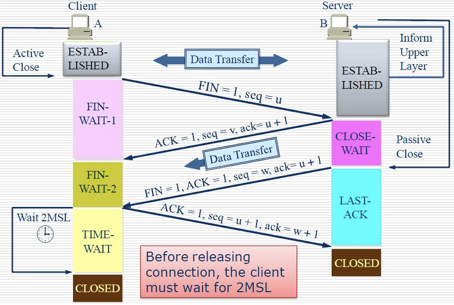
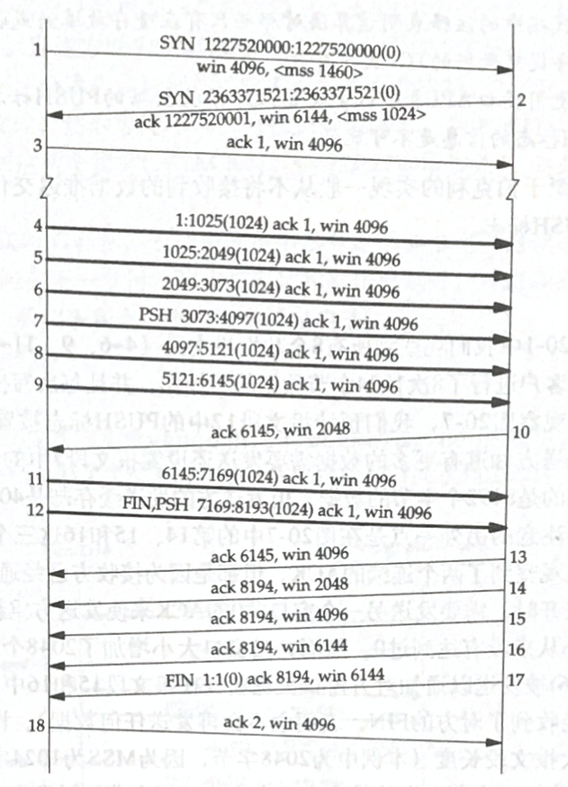

# TCP

## TCP Message Structure

- **Source port, Destination port**: Identify the remote and local port numbers.
- Serial number (**seq**)
- Confirmation number (**ack**): The seq of the **next datagram** you want to receive, which indicates that all data up to seq **N-1** has been **received** correctly.
- **ACK**: The **initial** seq of the expected data to be received.
- **SYN**: Used to **establish** a connection.
- **FIN**: Used to **release** the connection.
- Window size (**WIN**): The number of bytes can receive(the size of the **receiving window**) for flow control.
- **Checksum**: It was set up to ensure high reliability. It checks the sum of head, data and pseudo-TCP head.

## TCP Three Handshakes

- **Explanation**:
    1. Client sends `SYN = 1`and `seq = x`  to Server.
    2. Server receives the package and returns `ack = x + 1`and `seq = y`.
    3. Client receives the package and returns `ack = y + 1`and `seq = x + 1` .
    
    <aside>
    💡 Connection has been established.
    
    </aside>
    

## TCP Four Handwaves

- **Explanation**:
    1. Client requests to disconnect from the Server and sends `FIN = 1`and `seq = u`. Now Client has been disconnected.
    2. Server accepts the disconnection from Client and returns `ack = u + 1`and `seq = v`.
    3. Server requests to disconnect from the Client and sends `FIN = 1`and `seq = w`and `ack = u + 1`(next seq of datagram will receive). Now Server has been disconnected.
    4. Client accepts the disconnection from Server and returns`seq = u + 1`and `ack = w + 1`.
    
    <aside>
    💡 Connection has been closed.
    
    </aside>
    

## Reliable Transfer

- **Duplicate Cumulative Acknowledgements(重复累计确认重传）**
    
    If the sender receives 3 confirmations of the same package, it will retransfer the last unconfirmed package.
    
- **Retransmission Timeout**
    
    The sender uses an estimated time as the maximum timeout for the confirmation. If the confirmation package is not received after this upper limit, the sender will retransfer the packet.
    
- **Example**
    
    1. The sender sends the first TCP segment with `seq = 1` and 1460 bytes. The receiver responds with `ack = 1461` to indicate that it has fully received and requested the next message segment.
    2. The sender then sends the second TCP message segment with `seq = 1461` . The receiver responds with a TCP message segment with `ack =  2921` (1461+1460) to indicate that it has fully received and requested the next message segment.
    3. The sender did **not receive a response** after sending the third message, so when the timer was out, sender re-send the third message.
    4. The third message has been successfully received, and the receiver can directly **confirm the fifth message,** because the forth and fifth have been received.

## Slide Window

Both **Sender** and **Receiver** have a **window**. The Receiver tells the Sender its own window size through the **window field in the TCP message** and the Sender sets its own window size according to this value.

- If the **left** byte of the sending window has been **sent and received** confirmation, swipe to the right.
- If the **left** byte of the receiving window has **sent confirmation** to the host, swipe to the right.

The receiving window only **confirm the last sequentially**(按序到达) **byte**. For example, the byte received is {31, 34, 35}, where {31} arrives in order and {34, 35} are not, so only 31 is confirmed. After the sender received confirmation by a byte, it knows that all bytes before this byte have been received.

## Flow Control

**Receiver’s Advertised Window:** The message sender(can be client or server) indicates the number of bytes can be received in the `WIN`. The receiver sends up to the number of bytes allowed by `WIN` .

- **Example**:
    
    
    
    1. Message2: The **window** size provided is **6144 bytes**.
    2. Message4-9: The sender **sent** **6144** bytes data ****and stopped.
    3. Message10: **Confirmed** **6145** data (ack 6145) and the **window** size is **2048**.
    4. Message11-12: **Sent** **2048** bytes data and complete the customer's data transfer(**FIN**).
    5. Message13: The **same ack** as message10, but announced a **4096 window size**.
    6. Message14: **Confirmed** the last **2048** bytes of data and **FIN**.
    7. Message15-16: Only used to announce a larger window size.
    8. Message17-18: Complete the usual closure process(**FIN**).

## Congestion Control

### Slow Start

Suppose **cwnd is 1**, **swnd = cwnd**, so the sender can only send one message. After the receiver receives the message, it will send a confirmation to the sender. After receiving the confirmation message, the sender will **add cwnd to 2**. (2 ⇒ 4, 4 ⇒ 8…cwnd increases **exponentially**)

### Avoid Congestion

cwnd can only be added 1 **linearly**. Assuming that 4 of the 24 messages are **lost** and after a period of time, the **retransmission timer** of the 4 lost messages timed out, and the sender found the congestion. **ssthresh** reduced to **half of cwnd** and **cwnd** is placed at **1**.

### FRR (F**ast Retransmit and Recovery)**

The sender sends message1. After receiving the message1, the receiver will confirm message1. **Before the confirmation** **of message1** reaches the sender, the sender can also **send message2**. If the sender receives **3 repeated confirmations**, it immediately retransmit the message.

## SACK (Selective Acknowledgment)

- The TCP protocol was **inefficient** when packets were lost.
    
    For example, **10,000 bytes** of data are sent through **10 groups**. If the **first group is lost**, the receiver cannot say that it has successfully received 1,000 to 9,999 bytes, but has not received the first group containing 0 to 999 bytes. Therefore, the sender may have to **retransit all 10,000 bytes**.
    

<aside>
💡 Therefore, TCP took the Selective Acknowledgment (SACK), which allows the receiver to confirm that it successfully receives the discontinuous group.

</aside>