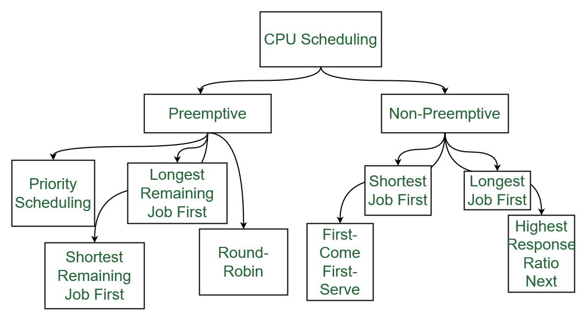

# CPU Scheduling

## Non-Preemptive Scheduling

### First-Come First-Serve

- **Easy** to implement

---

- Average **waiting** time is higher

### Shortest Job First

- **Reduce** average waiting time

---

- `Starvation`
- Complicated to **predict** upcoming CPU request

### Longest Job First

- All the jobs or processes finish at the **same time** approximately

---

- Very high average **waiting** time

## Preemptive Scheduling

### Priority Scheduling

- Average waiting time is **less** than FCFS and less complex

---

- `Starvation`

### Round Robin

- Seem to be **fair** as every process gets an equal share of CPU

### Shortest Remaining Time First

- **Little cost** since system only makes decisions when a process completes or a new process is added

---

- `Starvation`
- Long process may be **held off** if short processes are continually added

### Longest Remaining Time First

- All the jobs or processes finish at the **same** time approximately

---

- Very high average **waiting** time