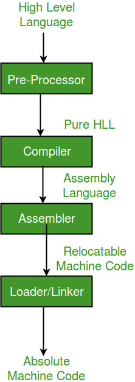

# Compile

- **Preprocessor**: A source program can be divided into many modules and preprocessor is responsible for **combining** them. It removes all the `#include` directives by **including the files** called file inclusion and all the `#define` directives using **macro expansion**.
- **Compiler**: Produce an assembly language program. e.g. Java compiler
- **Assembly Language:** It’s neither in binary form nor high level. It is an **intermediate** state that is a **combination** of **machine instructions** and some **other useful data** needed for execution.
- **Assembler**: For **every platform** (Hardware + OS) we will have an assembler. They are not universal since for each platform we have one. The output of the assembler translates assembly language to **machine code**.
- **Relocatable Machine Code:** It can be loaded at any point and can be run. The **address** within the program will be in such a way that it will **cooperate with the program movement**.
- **Loader/Linker:** It converts the relocatable code into **absolute code** and tries to **run the program** resulting in a running program or an error message (or sometimes both can happen). **Linker** loads a **variety** of object files into a **single** file to make it executable. Then **loader** loads it in **memory** and executes it.

## Linker

- **Static** link
    
    **Before** the program is **loaded into memory** and running, all its **target modules** and required library functions have been linked and **assembled** into a **complete** executable program and will **not be split** thereafter.
    
- **Dynamic** link
    
    **Link** while the program **is loaded** to generate an executable program. If an **external module** call occurs, the search, mounting and link of the external target module will be triggered.
    
- **Runtime** link
    
    During the **execution** of the program, if it is found that the called module or library function has not been linked, **search in memory first** to see if the memory is loaded. If it has been loaded, it will be directly linked to the calling program, otherwise the module will be searched for **external memory**.
    

## Loader

- **Absolute** loading
    
    The instruction address in the **loading module** is the **same** as the address in its **memory**. All addresses are **absolute addresses.**
    
- **Relocate** loading
    
    Put the loading code module into the physical position of the memory depending on the usage of memory at that time. The **relative addresses** are used in the module.
    
- **Dynamic running** loading
    
    In order to improve memory utilization, the program loaded into memory can be replaced on **disk** and then transferred to memory. The position of the program in memory before and after replacement may be different.
    

> The loading module in the disk uses a logical address, and when the process runs, its loading code module will be loaded into the physical address space. The process of converting logical address into a physical address is called "**address relocation**".
> 
- **Static address** relocation
    
    All logical addresses are **modified** to physical addresses. The address conversion is completed only once before the process is executed.
    
- **Dynamic address** relocation
    
    The **starting address** of the program memory is placed in the **relocation** **register**. Whenever the CPU refers to the memory address, **adds the value** of the relocation register before it is sent to memory.
    
- **Runtime link address** relocation