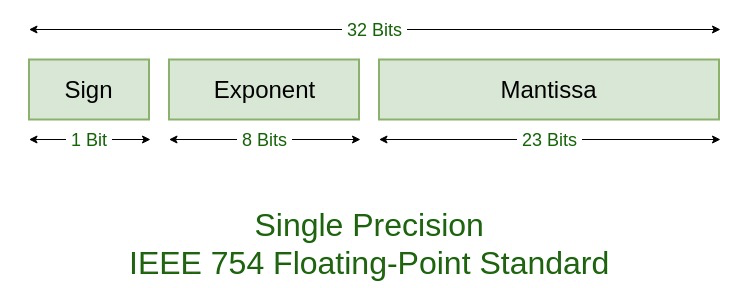
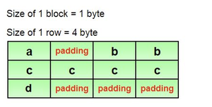

# Computer Structure

## Data Representing

- **Original Code**
    
    First digit represents symbol and the rest represent value.
    
    ```
    [+1]original = 0000 0001
    
    [-1]original = 1000 0001
    
    range:
    
    [1111 1111 , 0111 1111]
    
    即
    
    [-127 , 127]
    ```
    
- **Inverse Code**
    - Positive number: itself.
    - Negative number: the symbol bit remains unchanged, and the remaining bits are reversed.
    
    ```
    [+1] = [00000001]original = [00000001]inverse
    
    [-1] = [10000001]original = [11111110]inverse
    ```
    
- **Complement**
    - Positive number: itself.
    - Negative number: inverse code +1
    
    ```
    [+1] = [00000001]original = [00000001]inverse = [00000001]complement
    
    [-1] = [10000001]original = [11111110]inverse = [11111111]complement
    
    1+（-1)= 00000001 + 11111111 = 00000000 = 0
    ```
    

> In a computer system, numeric values are always represented and stored by **complements**.
> 

## **IEEE Standard 754 Floating Point Numbers**

1. **The Sign of Mantissa –** 0 represents a positive number while 1 represents a negative number.
2. **The Biased exponent –**The exponent field needs to represent both positive and negative exponents. 
3. **The Normalised Mantissa –**The mantissa is part of a number in scientific notation or a floating-point number, consisting of its significant digits. A normalised mantissa is one with only one 1 to the left of the decimal.




- **Example**
    
    ```
    85.125
    85 = 1010101
    0.125 = 001
    85.125 = 1010101.001
           =1.010101001 x 2^6
    sign = 0
    
    1. Single precision:
    biased exponent 127+6=133
    133 = 10000101
    Normalised mantisa = 010101001
    we will add 0's to complete the 23 bits
    
    The IEEE 754 Single precision is:
    = 0 10000101 01010100100000000000000
    This can be written in hexadecimal form 42AA4000
    
    2. Double precision:
    biased exponent 1023+6=1029
    1029 = 10000000101
    Normalised mantisa = 010101001
    we will add 0's to complete the 52 bits
    
    The IEEE 754 Double precision is:
    = 0 10000000101 0101010010000000000000000000000000000000000000000000
    This can be written in hexadecimal form 4055480000000000
    ```
    
- **Zero –** an exponent and mantissa of 0. -0 and +0 are distinct values, though they both are equal.
- **Denormalised –** this number does not have an assumed leading one before the binary point.
- **Infinity –** The sign bit distinguishes between negative infinity and positive infinity.
- **Not A Number (NAN) –** an error. This is a special value that might be used to denote a variable that doesn’t yet hold a value.

| EXPONENT | MANTISA | VALUE |
| --- | --- | --- |
| 0 | 0 | exact 0 |
| 255 | 0 | Infinity |
| 0 | not 0 | denormalised |
| 255 | not 0 | Not a number (NAN) |

## Little endian && Big endian

- **Little endian**: Low-byte data is stored at a low memory address, and high-byte data is stored at a high memory address.
- **Big endian**: High-byte data is stored at a low memory address, and low-byte data is stored at a high memory address.
    
    > All network protocols use Big endian to transmit data.
    > 

```
0x12345678 ：

    Big Endian
    low
    high
    ---------------------------------------------------->
    +-+-+-+-+-+-+-+-+-+-+-+-+-+-+-+-+-+-+-+-+-+-+-+-+-+-+
    |     12     |      34    |     56      |     78    |
    +-+-+-+-+-+-+-+-+-+-+-+-+-+-+-+-+-+-+-+-+-+-+-+-+-+-+

    Little Endian
    low
    high
    ---------------------------------------------------->
    +-+-+-+-+-+-+-+-+-+-+-+-+-+-+-+-+-+-+-+-+-+-+-+-+-+-+
    |     78     |      56    |     34      |     12    |
    +-+-+-+-+-+-+-+-+-+-+-+-+-+-+-+-+-+-+-+-+-+-+-+-+-+-+
```

## Byte alignment

> Improve the speed of access to data.
> 

```cpp
struct
{
    char a;
    short int b;
    int c;
    char d;
}
```

