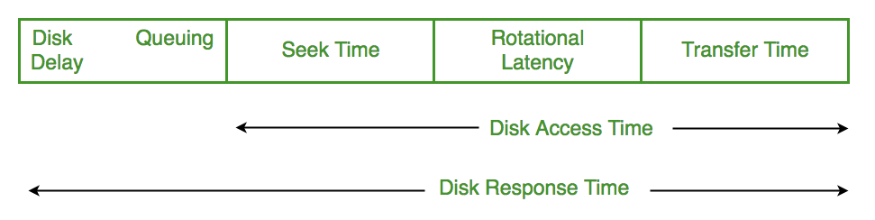
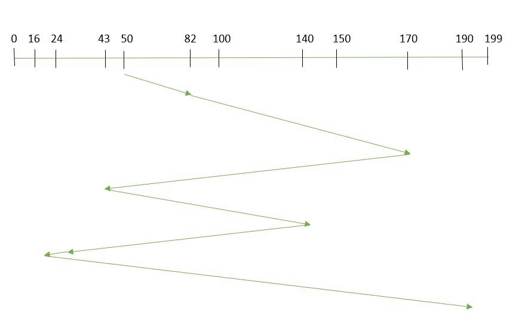
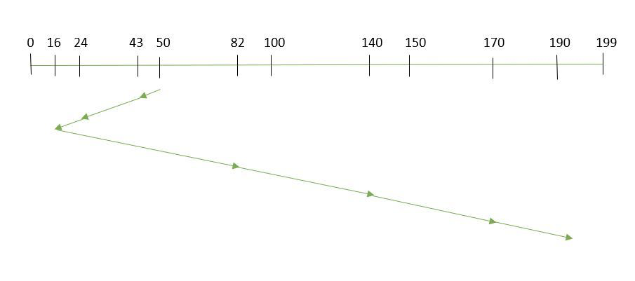
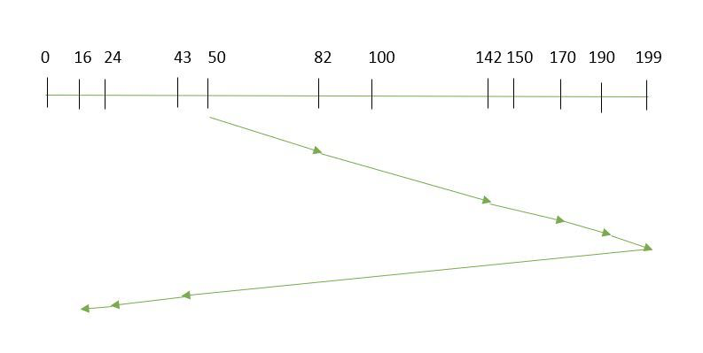
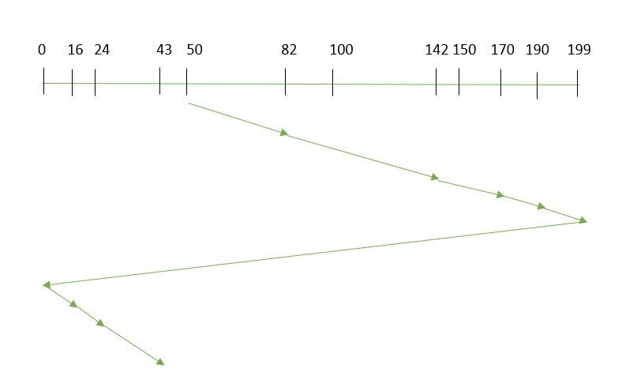
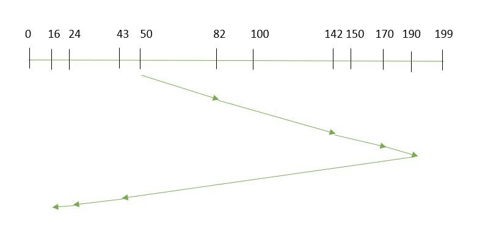
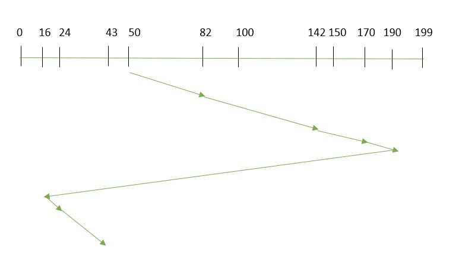

# Disk

- **Seek Time**
    
    The time taken to locate the disk arm to a specified **track** where the data is to be read or write. 
    
- **Rotational Latency**
    
    The time taken by the desired sector of disk to **rotate** into a position so that it can access the read/write heads. 
    
- **Transfer Time**
    
    The time to **transfer the data**. It depends on the rotating speed of the disk and **number of bytes** to be transferred.
    

## Scheduling algrithm

### **FCFS**

- **Example**
    
    Suppose the order of request is (82,170,43,140,24,16,190)
    
    And current position of Read/Write head is : 50
    
    
    
    Total seek time = (82-50)+(170-82)+(170-43)+(140-43)+(140-24)+(24-16)+(190-16) =642 
    

Advantages: 

- Every request gets a **fair** chance
- No indefinite postponement

Disadvantages: 

- Does **not** try to **optimize** seek time
- May not provide the best possible service

### **SSTF(Shortest Seek Time First)**

- **Example**
    
    
    
    Total seek time = (50-43)+(43-24)+(24-16)+(82-16)+(140-82)+(170-140)+(190-170) =208
    

Advantages: 

- **Average** Response Time **decreases**
- Throughput increases

Disadvantages: 

- Overhead to **calculate seek time in advance**
- Can cause **Starvation** for a request if it has higher seek time as compared to incoming requests
- High variance of response time as SSTF favors only some requests

### **SCAN(elevator algorithm)**

- **Example**
    
    
    
    Total seek time = (199-50)+(199-16) =332
    

Advantages: 

- High throughput
- Low variance of response time
- **Average** response time

Disadvantages: 

- **Long waiting time** for requests for locations **just visited** by disk arm

### CSCAN

- **Example**
    
    
    
    Total seek time = (199-50)+(199-0)+(43-0) =391
    

Advantages: 

- Provides **more uniform wait time** compared to SCAN

### LOOK

- **Example**
    
    
    
    Total seek time = (190-50)+(190-16) = 314
    

### CLOOK

- **Example**
    
    
    
    Total seek time = (190-50)+(190-16)+(43-16) = 341