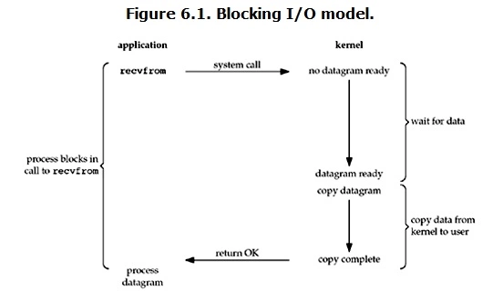
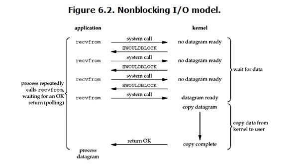
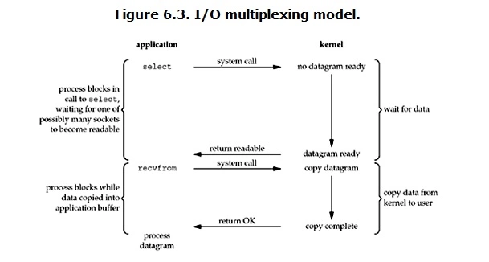
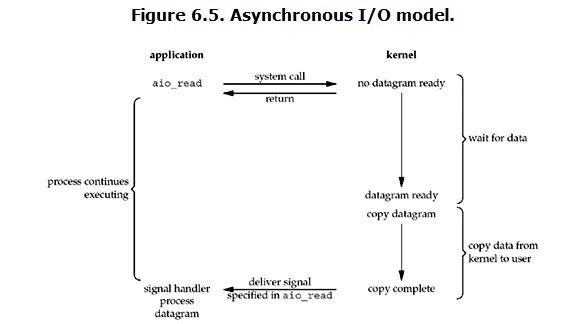

# IO

For an IO access (for example, read), it will go through **two stages**:

1. Waiting for data preparation
2. Copy data from the kernel to the process

## Blocking IO

When the user process calls the system call `recvfrom`, the kernel begins preparing data and this process requires waiting. The user process will be blocked (**blocked by itself**). When the data is ready, kernel will copy the data to the user memory, and then the kernel returns the result before the user process releases the block state and runs again.

## Non-blocking IO

When the user process sends a read operation, kernel will immediately **returns an error** if the data s not ready. When the user process receives an error, it knows that the data is not ready, so it can send the read operation again. Once the data in the kernel is ready and the **user process sends a system call again**, it will immediately copy the data to the user memory and then return.

## IO Multiplexing

When the user process calls `select`, the whole process will be blocked by `select` function. At the same time, `select，poll，epoll`will poll all `socket`it is responsible for. When the data in any socket is ready, `select` will return. At this time, the user process calls the read operation to copy the data from the kernel to the user process.

<aside>
💡 The advantage of I/O multiplexing is that **a user process** can wait for **multiple file descriptors** at the same time through a mechanism.

</aside>

### Select VS Epoll

1. The socket descriptor (**FD**) that a process can open is **not limited** in `epoll`.
2. I/O `efficiency` will not decrease linearly as the number of FDs increases.
3. Easier API.

## Asynchronous IO

After the user process initiates the read operation, it can do other things immediately. When kernel receives `asynchronous read`, it will return immediately and **won’t block** the user process. Kernel then waits for the data to be ready, and copies the data to the user's memory. When all done, the kernel will **send a signal** to the user process telling it that the read operation is completed.

## Blocking VS Non-Blocking

- Blocking: The caller thread **can’t do other things** until data has been received.
- Non-Blocking: The caller thread can do **other things** while waiting for data.

## Synchronous VS Asynchronous

- Synchronous: Causes the requesting process to be **blocked** until that I/O operation completes.
    - Blocking IO
    - **Non-Blocking IO** (copy data from kernel to user will block the process)
    - IO Multiplexing
- Asynchronous: does **not** cause the requesting process to be **blocked**.