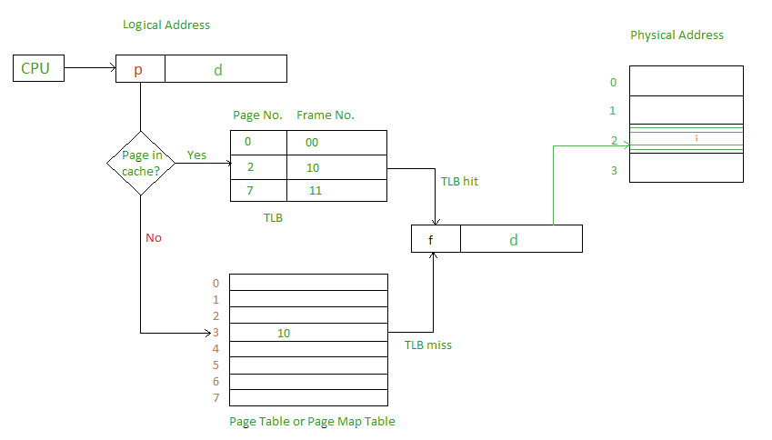

# Memory

## Virtual Memory

<aside>
💡 It makes the application think that it has continuous available memory (a continuous and complete address space), but in fact, it is usually separated into multiple physical memory fragments.

</aside>

### MMU

> Memory Management Unit: **Conversion** from virtual address to physical address.
> 

### TLB

- **Steps in TLB hit:**
    1. CPU generates virtual (logical) address. 
    2. It is checked in TLB (present). 
    3. Corresponding frame number is retrieved, which now tells where in the main memory page lies. 
- **Steps in TLB miss:**
    1. CPU generates virtual (logical) address. 
    2. It is checked in TLB (not present). 
    3. Now the page number is matched to page table residing in main memory (assuming page table contains all PTE). 
    4. Corresponding frame number is retrieved, which now tells where in the main memory page lies. 
    5. The TLB is updated with new PTE (if space is not there, one of the replacement technique comes into picture i.e either FIFO, LRU or MFU etc). 

**Effective memory access time(EMAT) :** 

$$
EMAT = h*(c+m) + (1-h)*(c+2m) 
$$

where h = hit ratio of TLB, m = Memory access time, c = TLB access time

## Memory Management

1. **Block** management: Divide the memory into several **fixed-sized blocks**, each containing only **one process**. If the program only needs a small amount of space to run, a large part of the allocated memory will be almost **wasted**.
2. **Page** management: Divide the main memory into the **fixed-sized pages**. The pages are **smaller**, which improves memory utilization and **reduces fragmentation**. 
3. **Segment** management: Page has no practical significance, but segment is **meaningful**. Each segment defines a set of **logical information**, such as the main program segment `MAIN`, sub-program segment `X`, data segment `D` and stack segment `S`. 

## Page VS Segment

- **Common**:
    - Improve memory utilization and reduce memory fragmentation.
    - **Different** pages or segments are **stored discontinuously**, but the memory in **each** page and segment is **continuous**.
- **Differences**:
    - The **size** of the **page is fixed** and determined by the operating system, while the size of the **segment is not fixed**, depending on the program we are currently running.
    - Paging **meaningless**, but segments are units of logical information.

## Page scheduling algorithm

1. **FIFO** algorithm
    
    First-in, First-out, **eliminate the earliest** page to be transferred.
    
    > **Bélády's anomaly**: Increasing the number of page frames results in an increase in the number of page faults.
    > 
2. **OPT(MIN)** algorithm
    
    Eliminate the page that will be used as far as possible in the **future**, which only exists in theory and cannot be applied in practice.
    
3. **LRU** (Least-Recently-Used) algorithm
    
    Use past history to eliminate pages that have not been used for recent times (also known as the **least used recently**). The performance is closest to OPT. 
    
4. **LFU** (Least Frequently Used) algorithm
    
    The **least frequently used** page permutation algorithm requires the **replacement** of pages with the **smallest number of references** during page permutation, because the frequently used pages should have a large number of references. 
    
5. **Clock**
    
    Associate **a use bit(0/1)** to each page frame. When the page is first loaded into memory or revisited, the bit will be 1. Every time it needs to be replaced, find the first frame with a bit of 0 to replace it. During the scanning process, if you encounter a frame with a bit of 1, replace it with 0. If the all frames use 0 bits, replace the first frame.