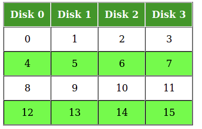
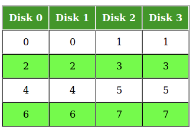
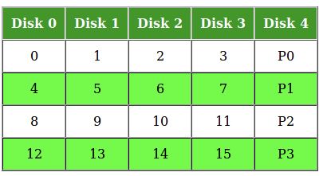
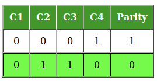
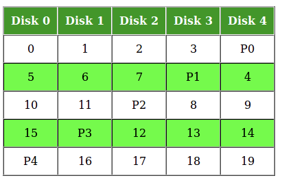

# RAID

<aside>
💡 “Redundant Arrays of Independent Disks” makes use of a combination of **multiple disks** instead of using a single disk for increased performance, data redundancy or both.

</aside>

## Data Redundancy

> Although taking up extra space, adds to **disk reliability**. In case of disk failure, if the same data is also **backed up** onto another disk, we can retrieve the data and go on with the operation.
> 

## RAID Levels

### RAID-0 (Stripping)

- **Reliability: 0**
    
    There is **no duplication** of data. Hence, a block once lost cannot be recovered.
    
- **Capacity: N*B**
    
    The **entire space** is being used to **store data**. Since there is no duplication, N disks each having B blocks are fully utilized.
    

### RAID-1 (Mirroring)

- **Reliability: 1 to N/2**
    
    Blocks have **duplicates on some other disk**. If we are lucky enough and disks 0 and 2 fail, then again this can be handled as the blocks have duplicates on disks 1 and 3. So, in the best case, N/2 disk failures can be handled.
    
- **Capacity: N*B/2**
    
    Only **half the space** is being used to **store data**. The other half is just a mirror to the already stored data.
    

### RAID-4 (**Block-Level Stripping with Dedicated Parity)**

- **Reliability: 1**
    
    Allows **recovery of at most 1 disk failure** (because of the way parity works). If more than one disk fails, there is no way to recover the data.
    
- **Capacity: (N-1)*B**
    
    **One disk** in the system is reserved for **storing the parity**. Hence, (N-1) disks are made available for data storage, each disk having B blocks.
    

- **Parity**
    
    If the data bits are 0,0,0,1 the parity bit is XOR(0,0,0,1) = 1. If the data bits are 0,1,1,0 the parity bit is XOR(0,1,1,0) = 0. A simple approach is that **even number** of **ones** results in **parity 0**, and an **odd number** of **ones** results in **parity 1**.
    
    
    
    Assume that in the above figure, **C3 is lost** due to some disk failure. Then, we can recompute the data bit stored in C3 by looking at the **values** of all the other **columns** and the **parity bit.** This allows us to r**ecover lost data**.
    

### **RAID-5 (Block-Level Stripping with Distributed Parity)**

- **Reliability: 1**
    
    Allows recovery of at most 1 disk failure (because of the way parity works). If more than one disk fails, there is no way to recover the data. 
    
- **Capacity: (N-1)*B**
    
    Overall, space **equivalent** to **one disk** is utilized in **storing the parity**. Hence, (N-1) disks are made available for data storage, each disk having B blocks.
    

- **Improve performance from RAID-4**
    - RAID-4: Each change requires writing to the **single parity disk**, which means things can **queue waiting** to update the parity data on that disk.
    - RAID-5: **Reduction** in queue because the **parity** update load is **spread across multiple** disks, so there's less chance if getting stuck in a queue.