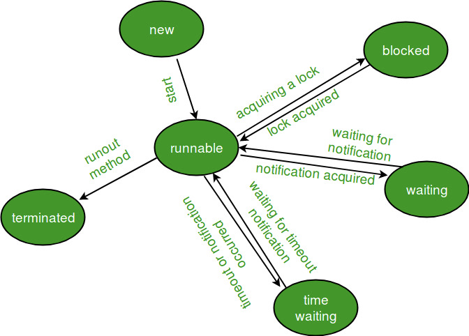

# Thread

## Process VS Thread

- **Process**: The smallest unit of **resource allocation**. **Static** and used to allocate resources.
- **Thread**: The smallest unit of **CPU scheduling**. **Dynamic** and used to **execute instructions**.

| Process | Thread |
| --- | --- |
| It is a computer program that is under execution. | It is the component or entity of the process that is the smallest execution unit. |
| It can be divided into multiple threads. | It can’t be further subdivided. |
| It has its own memory space and run-in separate memory space. | It uses the memory of the process it belongs to and run-in shared memory space.. |
| These are heavy-weight operators. | These are light-weight operators. |
| It requires more resources. | It requires fewer resources. |

## State

### New

> A new thread is **created**.
> 

### Runnable

> A thread is running or is ready to run(waiting for **CPU**).
> 

### Blocked

> A thread blocked waits for a monitor lock to enter synchronized block/method.
> 

<aside>
💡 A synchronized method is used to ensure that only **one thread** can execute it at a time.

</aside>

### Waiting

> A thread is waiting for another thread to perform a **particular action**.
> 

### Timed Waiting

> A thread calls a method with **timeout**.
> 

### Terminated

> A thread has **completed execution**.
> 



## Context Switch

1. Thread **gives up the CPU**, such as calling `sleep()`, `wait()`.
2. **Time slices** run out. The operating system wants to prevent a thread or a process from occupying the CPU for a long time and causing other threads or processes starvation.
3. A system interrupt, such as requesting an IO, and the thread is **blocked**.

## Runnable VS Callable

<aside>
💡 The Runnable interface will **not return** results or throw exceptions, but the Callable interface will.

</aside>

- **Code**
    
    ```java
    public interface Runnable {
        public abstract void run();
    }
    ```
    
    ```java
    public interface Callable<V> {
        V call() throws Exception;
    }
    ```
    

## execute() VS submit()

- The `execute()` method is used to commit tasks that do **not require return values**, so it is impossible to judge whether the task has been executed successfully by the thread pool.
- The `submit()` method is used to submit tasks that **require a return value**. The thread pool will return an object of `Future` type, through which you can judge whether the task is executed successfully. The return value can be obtained through the `get()` method of Future.

## Important Methods

- `Thread.yeild()`
    1. Release lock
    2. Running ⇒ Runnable
- `Thread.sleep()`
    1. Release lock
    2. Running ⇒ Timed Waiting
- `Thread.join()`
    1. `t2.join()` 
    2. t1 releases Object lock 
    3. t1 Running ⇒ Waiting
    4. t2 finished
    5. t1 Waiting ⇒ Running
    
    > Bottom logic is `wait()`.
    > 
- `Object.wait()`
    1. Release locks
    2. Running ⇒ Waiting
    3. Wait for another thread to call `Object.notify()` or `Object.notifyAll()`
    4. Waiting ⇒ Blocked
    5. Wait to enter synchronized block
    6. Receive the monitor lock
    7. Blocked ⇒ Running
